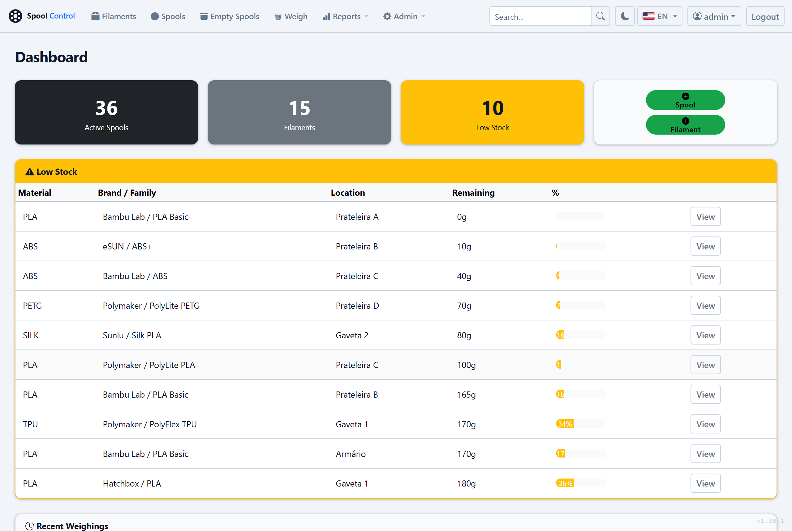
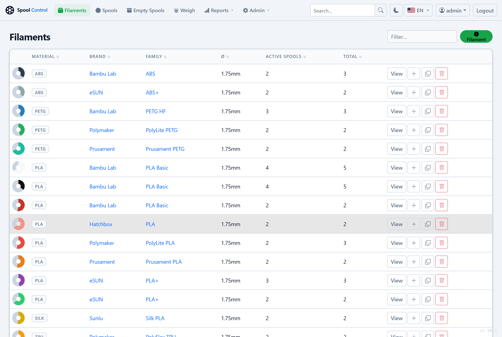
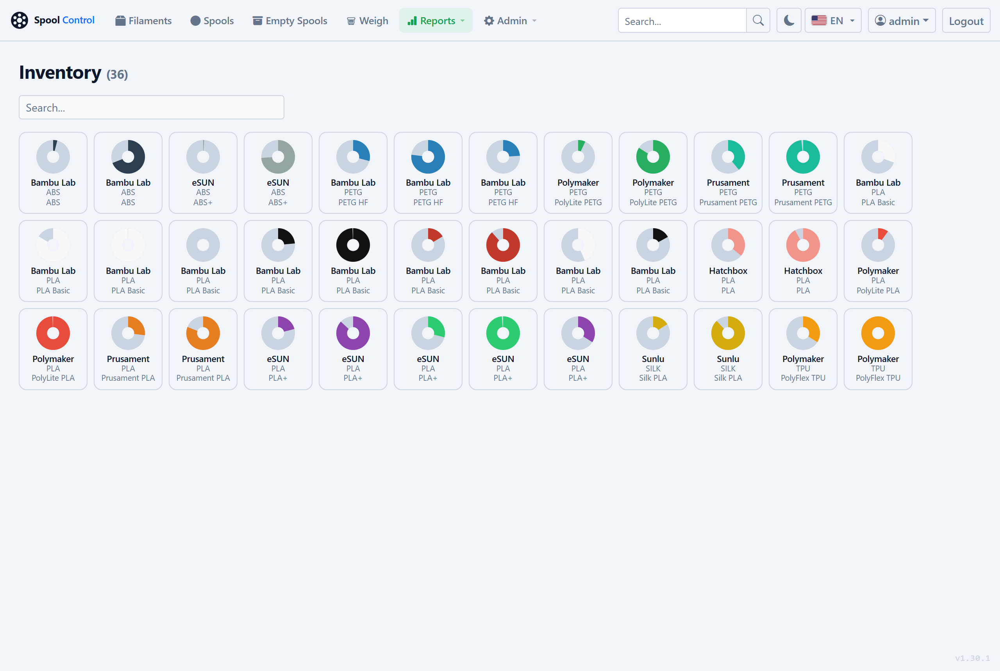
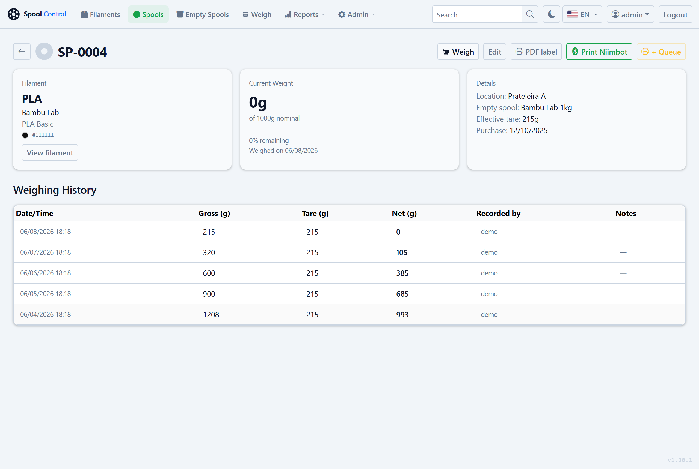
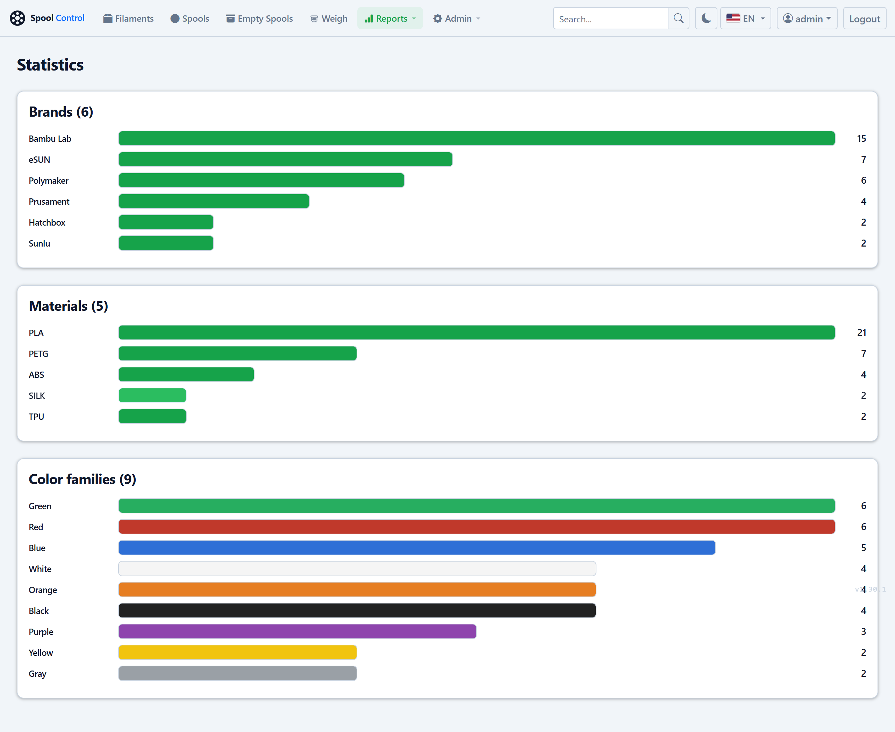
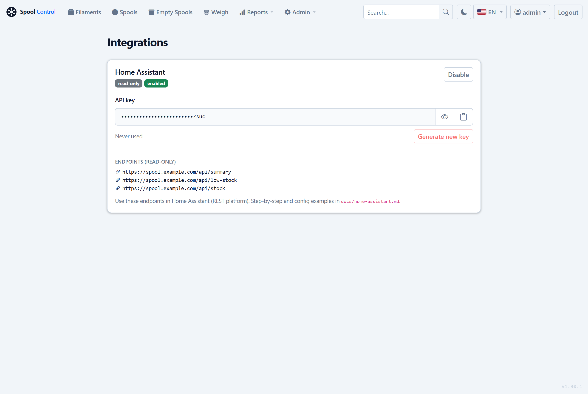

# Spool Control

Web app for managing 3D-printing filaments.

Register filaments, catalog spools, weigh them with automatic tare subtraction,
print 60×40mm thermal labels with a QR code, and get stock reports.

## Live Demo

**[spool-demo.duckdns.org](https://spool-demo.duckdns.org)** — login: `admin` / `demo`

> Data resets daily at midnight UTC. Password and user creation are disabled.

## Screenshots


*Dashboard — stock summary and low-stock alerts.*

| Filaments | Inventory |
|---|---|
|  |  |
| Filament registry with per-spool stock | Visual inventory with remaining-weight donuts |

| Spool detail & weighing history | Statistics |
|---|---|
|  |  |
| Per-spool weighing history (gross − tare = net) | Breakdown by brand, material and color |


*Admin → Integrations — manage independent API keys (Home Assistant shown).*

## Features

- Filament registry (material, brand, family, color) with automatic brand logos
- Multiple spools per filament with a full weighing history
- Quick weigh: enter the spool code and the gross weight — the system subtracts the tare
- 60×40mm PDF labels with a QR code (points to the spool page — login required)
- **Direct thermal printing to Niimbot** (B1 / B1 Pro / M2-H) straight from the browser via Web Bluetooth — no Niimbot app required
- Batch label print queue
- Reports: inventory, statistics, by material, by location, low stock, weight history
- Search and sorting on listings
- Authentication with access control (admin / viewer); the admin must set a new password on first login
- Automatic daily backups (7-day rotation, optional external copy) plus on-demand backup/restore — see [Backup](#backup)
- Multi-language UI: **Portuguese, English and Spanish** (see [Languages (i18n)](#languages-i18n))
- Weighing API for automatic stations (`POST /api/weigh`) — see [Weighing API](#weighing-api)
- Home Assistant integration (read-only stock API) — see [Home Assistant](#home-assistant)

## Stack

| Layer | Technology |
|---|---|
| Backend | Flask 3.x + Gunicorn |
| Database | SQLite (WAL mode) |
| Frontend | Bootstrap 5.3 + Bootstrap Icons (vendored, served same-origin — no CDN) |
| Labels | ReportLab + qrcode + Pillow |
| Deploy | Systemd + Traefik |

## Structure

```
spool-control/
├── app.py              # Core: app factory, security (CSP/CSRF), auth, logging, error handlers
├── routes/             # Routes by area: main, filaments, spools, spool_models, label_queue,
│                       #   reports, admin, api, account, integrations
├── database.py         # SQLite schema and helpers (no ORM)
├── backup.py           # Backup/restore (manual download + daily rotation)
├── labels.py           # Label PDF / thermal PNG / QR generation
├── logger.py           # Structured JSON logging + secret masking
├── translations.py     # UI translations (i18n: PT/EN/ES)
├── filament_catalog.py # Vendored SpoolmanDB catalog loader
├── niimbot_registry.py # Vendored Niimbot models/sizes
├── requirements.txt
├── static/
│   ├── spool.css / spool.js     # Styles + client-side filter/sorting
│   ├── vendor/                  # Bootstrap + Bootstrap Icons (vendored, no CDN)
│   ├── niimbot*.js              # Vendored Web Bluetooth driver + integration
│   └── brands/                  # Brand logos (downloaded post-install)
├── templates/
├── tools/
│   └── validate_qr_autoweigh.py  # Validate the QR/auto-weigh flow without hardware
└── deploy/
    ├── proxmox-deploy.sh / setup-inside.sh / update-lxc.sh / update-cli.sh
    ├── gunicorn.conf.py
    ├── spool-control.service
    ├── spool-update.{service,path}    # privilege-separated web update (flag-file + watcher)
    ├── spool-backup.{service,timer}   # daily rotating backup
    ├── vendor-frontend.sh / vendor-niimbot.sh / vendor-spoolmandb.sh
    ├── seed_brands.py / seed-demo-data.py
    └── proxmox-helper/                # community-scripts compatible format (future PR)
```

`data/` (DB + backups) and `spool.env` live outside git (generated on the server).

## Public URL / domain (important)

The label **QR code encodes `<app_base_url>/spools/<id>`**, so `app_base_url` must be the
URL that will actually be reached when the QR is scanned (phone, or the automatic weighing
station). Each install runs on **its own server**, so this is per-install:

- **With a public domain** (behind an HTTPS proxy): the QR uses `https://your.domain` and
  works from anywhere.
- **Without a domain**: the install falls back to the internal IP (`http://IP:8001`) and
  the installer warns that it works on the **local network only** — QR codes won't open
  from outside the LAN.

You can change it anytime in **Admin → Settings → "Base URL"**; saving applies everywhere
(QR codes, labels, links). On a fresh install the value is seeded from the `APP_BASE_URL`
set by the installer — never `localhost`.

## Languages (i18n)

The UI is available in **Portuguese (PT-BR)**, **English (EN)** and **Spanish (ES)**,
selectable from the flag at the top. Translations live in **`translations.py`** (tables
`_EN`/`_ES`/`_PT`).

The step-by-step to **add a new language** is in [`docs/i18n.md`](docs/i18n.md).

## Weighing API

Machine-to-machine endpoints for an automatic weighing station (e.g. a scale + QR reader +
ESP32 — see [`docs/estudo_balanca_qrcode.md`](docs/estudo_balanca_qrcode.md)).
Authenticated by `X-API-Key`. The scale uses a **write-scoped** key, seeded at install from
the `SPOOL_API_KEY` env var and managed in **Admin → Integrations**. Requests without a valid
key get **401** — there is no open-by-default mode. CSRF-exempt.

- `POST /api/weigh` — body `{"spool_id": 1, "gross_weight_g": 532}` → records the weighing
  (`net = gross − tare`) and returns JSON with `net_weight_g` and `remaining_pct`.
- `GET /api/spools/<id>` — spool data (read-only) for confirmation before recording.

```bash
curl -X POST https://your.domain/api/weigh \
  -H "X-API-Key: <key>" -H "Content-Type: application/json" \
  -d '{"spool_id":1,"gross_weight_g":532}'
```

The station reads the QR, extracts the spool id (anchored on `/spools/(\d+)`) and POSTs.
The full flow can be validated without hardware via `tools/validate_qr_autoweigh.py`.

> **API keys** are managed per integration in **Admin → Integrations** (the scale's
> write key and the Home Assistant read key are independent — rotating one does not
> affect the other). On existing installs the scale key is seeded from `SPOOL_API_KEY`.

## Home Assistant

Read-only endpoints let Home Assistant track your filament stock (total kg, what's
running low, breakdown by material/location) via its native REST platform — no MQTT,
no custom component. Get the read-only key in **Admin → Integrations** and follow the
step-by-step (sensors, automations) in [`docs/home-assistant.md`](docs/home-assistant.md).

- `GET /api/summary` — totals + low-stock count + by material
- `GET /api/low-stock` — spools below the configured threshold
- `GET /api/stock` — stock aggregated by material and by location

## Deploy — Proxmox LXC

### Automatic install (recommended)

Run it **on the Proxmox VE host** (PVE 7+). The installer creates a Debian 12 LXC and
configures the whole system, asking for CTID, hostname, network, resources and URL:

```bash
bash -c "$(curl -fsSL https://raw.githubusercontent.com/iscarelli/spool-control/main/deploy/proxmox-deploy.sh)"
```

At the end it prints the IP, the access URL and the **initial admin password**. The
repository is public — no GitHub credentials needed.

> If you provide a **domain** (behind an HTTPS proxy) it enables `SECURE_COOKIES=1` and the
> QR uses `https://your.domain`. **Without a domain** it uses the internal IP
> (`http://IP:8001`) — **local network only** (see [Public URL / domain](#public-url--domain-important)).

### Manual install (alternative)

On an existing Debian 12 LXC, as root:

```bash
bash <(curl -fsSL https://raw.githubusercontent.com/iscarelli/spool-control/main/deploy/setup-inside.sh)
```

Optional variables: `DOMAIN`, `APP_BASE_URL`, `SECURE_COOKIES`, `USE_BR_MIRROR`,
`ADMIN_DEFAULT_PASS`. The script installs dependencies, clones the repository
(anonymously), creates the virtualenv, configures the systemd service and prints the
initial admin password. It also generates a `SPOOL_API_KEY`.

### Configure HTTPS via Traefik (Proxmox Provider)

Traefik reads the LXC **Notes** field via the Proxmox API. Configure it like this:

```bash
pct set <VMID> -description $'traefik.enable=true
traefik.http.routers.spool.rule: Host(`spool.example.com`)
traefik.http.routers.spool.entrypoints=websecure
traefik.http.routers.spool.tls.certresolver=letsencrypt
traefik.http.services.spool.loadbalancer.server.url: http://<LXC_IP>:8001'
```

> **Label format:** use `=` for simple values and `: ` (with a space) when the value
> contains `:` (URLs and Host rules).
>
> **Unique names:** the router/service name (`spool` above) is **global** in Traefik —
> if you run more than one instance, give each a unique name (e.g. `spool`, `spooltest`),
> otherwise the routers collide and one of them returns 404.

Wait ~30s for Traefik to pick up the route. Check it at `https://spool.example.com/health`.

### Proxmox Helper Scripts (community-scripts)

Files in `deploy/proxmox-helper/` follow the [community-scripts/ProxmoxVE](https://github.com/community-scripts/ProxmoxVE) format
and will be submitted there once the project meets their requirements (6 months old, 600+ stars).
Until then, use the standalone installer above.

### Future updates

**Via the web UI (recommended):** in **Admin → Updates** (`/admin/update`), the admin sees
the current version vs. the latest release and updates with one click. A menu badge signals
when a new version is available.

**Via the command line** (alternative / recovery):

```bash
pct exec <VMID> -- bash /opt/spool-control/deploy/update-lxc.sh
# roll back to a specific tag/branch:
pct exec <VMID> -- bash /opt/spool-control/deploy/update-lxc.sh --ref v1.5.0
```

### Download brand logos

After the first access, run this to download logos for the best-known brands:

```bash
pct exec <VMID> -- /opt/spool-control/.venv/bin/python3 /opt/spool-control/deploy/seed_brands.py
```

Logos are saved to `static/brands/` and shown automatically in the filament listing. New
logos can be added in **Admin → Brands / Logos**.

## Initial credentials

- User: `admin`
- Password: randomly generated by `setup-inside.sh` (shown at the end of the install)

On the **first login the admin must set a new password** before using the system — the
generated one is temporary. The same forced change applies to any user created or
password-reset by an admin. You can change your password anytime later via the user menu →
**Change password**.

## Environment variables (`spool.env`)

Generated automatically by `setup-inside.sh`. Example:

```env
SECRET_KEY=<random hex>
ADMIN_DEFAULT_PASS=<initial password>
APP_BASE_URL=https://spool.example.com
SECURE_COOKIES=1
SPOOL_API_KEY=<random hex>
DEMO_MODE=0          # set to 1 to enable demo mode (see below)
```

### Demo mode (`DEMO_MODE=1`)

Restricts the instance for public demonstration:

- Password changes, user creation/deletion, settings changes and backup restore are disabled
- An informative banner is shown on every page
- Run `deploy/seed-demo-data.py` to populate the database with sample data
- Use `deploy/reset-demo.sh` + `spool-demo-reset.timer` for automatic daily resets (pulls latest release, then reseeds)

> `spool.env` is in `.gitignore` and must never be committed.

## Backup

Everything backup-related is under **Admin → Backup**.

- **Automatic daily backup**: a systemd timer keeps **7 rotating backups** — one per weekday
  (`spool-backup-1.zip` … `spool-backup-7.zip`), written atomically to `data/backups/`. Each
  is a `.zip` with the database + brand logos, validated before it replaces the previous one.
- **External copy (optional)**: set a folder in **Admin → Backup** (e.g. a mounted NAS/USB).
  The daily backup always writes locally and, if set, also copies there. If the external write
  fails, an alert shows on the Backup page (the local backup is unaffected).
- **Manual / restore**: on-demand download (timestamped name, separate from the rotation) and
  restore — upload a `.zip`, or restore one of the daily backups in one click.

## Observability / Logs

Every log line is a JSON object written to stdout and captured by systemd's journal.
Each request gets a unique 8-character `request_id` that is bound to all log lines
produced during that request and returned to the client as the `X-Request-ID`
response header.

### Typical log line

```json
{
  "event": "request",
  "level": "info",
  "request_id": "43a5ae17",
  "method": "GET",
  "path": "/filaments",
  "ip": "10.1.1.254",
  "user": "admin",
  "status": 200,
  "duration_ms": 8.3,
  "logger": "spool",
  "timestamp": "2026-06-05T11:53:04.474012Z"
}
```

Error lines include the full Python traceback inline:

```json
{
  "event": "spool.update_failed",
  "level": "error",
  "request_id": "c4d1e882",
  "spool_id": 42,
  "exception": "Traceback (most recent call last): ...",
  "timestamp": "..."
}
```

**Sensitive fields** (`password`, `senha`, `token`, `secret`, `api_key`, `authorization`,
`cookie`, `spool_api_key`, `password_hash`, `current_password`, `new_password`,
`secret_key`) are replaced with `***` before any log is written.

### Viewing logs

```bash
# Tail all logs in real time (on the LXC):
journalctl -u spool-control -f -o cat

# Last 200 lines:
journalctl -u spool-control -n 200 -o cat

# Errors and criticals only:
journalctl -u spool-control -o cat | grep -E '"level":"(error|critical)"'

# All events for a specific request (copy the id from the X-Request-ID header):
journalctl -u spool-control -o cat | grep '"request_id":"43a5ae17"'

# Requests slower than 100 ms (requires jq):
journalctl -u spool-control -o cat | \
  jq 'select(.event == "request" and .duration_ms > 100)'
```

From the **Proxmox host** (replace `117` with your VMID):

```bash
pct exec 117 -- journalctl -u spool-control -f -o cat
```

### Health check

`GET /health` returns a JSON object with per-component status and HTTP 503 if any
check fails:

```json
{
  "status": "ok",
  "version": "1.30.3",
  "demo_mode": false,
  "backup_age_h": 6.2,
  "checks": {
    "db": "ok",
    "data_dir": "ok"
  }
}
```

`status` is `"degraded"` (HTTP 503) when a check fails. `demo_mode` lets an external monitor
catch a `DEMO_MODE` leak into a real install, and `backup_age_h` (hours since the last
successful automatic backup, `null` if none) lets it alert when backups stop. Useful for
uptime monitors (`/health` does not require authentication).
